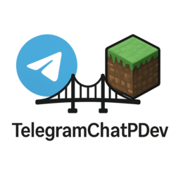

# 📦 TelegramChatPDev

**Seamless two-way messaging between Telegram and Minecraft!**  
Created with ❤️ by [ParamountDev](https://t.me/paramount1_dev)

---

## ✨ Overview

**TelegramChat** is a powerful Minecraft plugin that connects your Telegram bot to your server, enabling full-featured, bi-directional communication between players and Telegram users.

🧩 Plugin Highlights:

- 🔁 **Two-Way Messaging** — Link Telegram users with Minecraft players.
- 🖼️ **Image Support** — Render Telegram images in-game via ImageFrame.
- 🎤 **Voice Support** — Convert Telegram voice messages to readable chat.
- 😎 **Emoji Support** — Render emojis beautifully in Minecraft chat.
- 🛠️ **Highly Configurable** — Simple YAML-based setup.

---

## 🚀 Features

| Feature | Description |
|--------|-------------|
| 🔄 Bi-directional Chat | Messages flow both ways between Telegram and Minecraft |
| 🖼️ Telegram → ImageFrame | Send photos in Telegram → show them in Minecraft |
| 🎤 Voice Messages to Text | Use Vosk model to convert voice to readable messages |
| 😊 Emoji Friendly | Emojis sent via Telegram are rendered in-game |
| 🔒 Secure Player Linking | Accept/Deny requests via command |

---

## 🧩 Commands

| Command | Description |
|--------|-------------|
| `/tgchat stop` | 🔌 Disconnect your Telegram link |
| `/tgchat info` | ℹ️ View plugin usage info |
| `/tgchat author` | 👤 Show plugin author details |
| `/listenvoice <id>` | 🎧 Get transcription from a voice message |
| `/showimage <name> <url> <w> <h>` | 🖼️ Display image on frames from a URL |

> 💡 **To send messages from Minecraft → Telegram**, just start your message with `@`.

---

## ⭐ Support / Orders  
Need custom plugins or help with **TelegramChatPDev**?  
📬 Contact me on Telegram: [@paramount1_dev](https://t.me/paramount1_dev)

---

## 🔧 Guide
Simple guide how to setup **TelegramChatPDev** - [GUIDE](https://github.com/paramountDev/TelegramChatPDev/blob/main/GUIDE.md)

---

## 💡 License  
This plugin is distributed under a **closed license**.  
Please contact the author for usage rights or customizations.

---

> Made with ☕, ⚡, and 🧠 by **ParamountDev**

